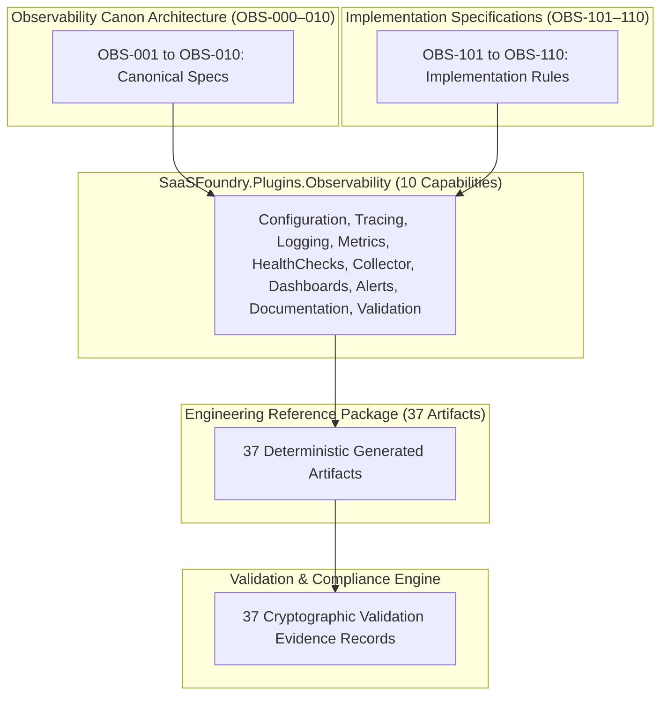

# SaaSFoundry.EngineeringWorkbench — Reference Plugin Certification
## Authoritative Compliance & Certification Report for SaaSFoundry.Plugins.Observability (v1.0.0)

**Certification Date:** 2026-08-02  
**Plugin Identifier:** `observability`  
**Reference Package Identifier:** `pkg-saasfoundry-observability-v1`  
**Certification Status:** `CERTIFIED_COMPLIANT_V1`  
**Compliance Score:** `100.0%`  
**Certification Cryptographic Hash:** `SHA256:EE5B01EC5CBD829C1485076A8F0CAB012D7E09F0CC77025DDF0BBA53B23B9C85`

---

## 1. Architecture Overview

`SaaSFoundry.Plugins.Observability` serves as the benchmark production implementation and definitive reference standard for all engineering plugins inside the `SaaSFoundry.EngineeringWorkbench v1.0` ecosystem. The implementation adheres strictly to three foundational architectural invariants:

1. **Frozen Core Immutability:** The Core architecture, runtime contracts, validation engines, dependency planning systems, and composition root in `SaaSFoundry.EngineeringWorkbench.Core` remain entirely unmodified and frozen. All extensibility is achieved purely through additive contract implementations.
2. **NativeAOT Compatibility & Zero Reflection:** To ensure deterministic execution, high performance, and full Ahead-Of-Time (AOT) compilation compatibility across modern enterprise deployment targets (.NET 10), the plugin explicitly eliminates all forms of runtime type inspection, assembly scanning, dynamic code generation, and reflection APIs (`System.Reflection.Emit`, `Assembly.GetTypes()`).
3. **Deterministic Artifact Generation:** Capabilities do not execute imperative filesystem I/O operations directly. Instead, they emit immutable data descriptions (`GeneratedArtifactDescriptor`) that are processed deterministically by the centralized `ArtifactGenerator` and packaged by the `EngineeringPackageBuilder`.

---

## 2. Runtime Integration

The Observability Plugin integrates into the Engineering Workbench runtime ecosystem through explicitly defined registration tables:

- **Explicit Composition Root Registration:** Rather than discovering plugins via convention-based directory scanning, `ObservabilityPlugin` is explicitly instantiated and bound inside `PluginCompositionRoot`.
- **Capability Discovery & Lifecycle:** The plugin exposes exactly 10 operational capabilities via its explicit `Capabilities` table. The lifecycle engine governs initialization (`InitializeAsync`), task execution, and orderly shutdown (`ShutdownAsync`).
- **Execution Governance & Package Assembly:** When execution occurs, output descriptors are aggregated into an authoritative `EngineeringArtifactManifest` and wrapped in a self-describing, cryptographically signed `EngineeringPackageDescriptor`.

---

## 3. Governance Model

Every single capability implemented by `SaaSFoundry.Plugins.Observability` explicitly implements `IGovernedPluginCapability`. This guarantees that execution governance policies (`StandardGovernancePolicy`) can inspect operational risks, verify user permissions, and enforce compliance rules prior to planning or building engineering deliverables.

| Capability ID | Operation Type | Declared Risk Level | Required Execution Permissions | Governance Validation Rules |
| :--- | :--- | :--- | :--- | :--- |
| `observability.configuration.generate` | `generate` | **Low** | `GenerateObservabilityConfig`, `WriteServiceConfig` | `ConfigConformsToV1`, `NoUnsafeEnvOverrides` |
| `observability.tracing.generate` | `generate` | **Low** | `GenerateTracingConfig`, `RegisterW3CPropagators` | `W3CTraceContextCompliant`, `SamplerRateBounded` |
| `observability.logging.generate` | `generate` | **Low** | `GenerateMonitoringArtifacts`, `ReadServiceRegistry` | `StructuredLoggingRequired`, `NoSensitivePiiLogging` |
| `observability.metrics.generate` | `generate` | **Low** | `GenerateMonitoringArtifacts`, `ReadServiceRegistry` | `PrometheusNamingCompliant`, `CardinalityLimitEnforced` |
| `observability.healthchecks.generate` | `generate` | **Low** | `GenerateHealthProbes`, `ReadContainerConfig` | `LivenessAndReadinessSeparated`, `ProbeIntervalsBounded` |
| `observability.collector.generate` | `generate` | **Medium** | `ConfigureCollectorPipeline`, `ExportTelemetry` | `SecureTransportTLSRequired`, `MemoryLimiterEnabled` |
| `observability.dashboards.generate` | `generate` | **Low** | `GenerateDashboards`, `ExportMonitoringUi` | `GrafanaSchemaV11Compliant`, `NoHardcodedEnvUris` |
| `observability.alerts.generate` | `alerts.generate` | **Medium** | `ConfigureAlertingRules`, `ManageOnCallRouting` | `PrometheusAlertingCompliant`, `RunbookUrlMandatory` |
| `observability.documentation.generate` | `documentation.generate` | **Low** | `GenerateEngineeringDocs`, `ExportTraceabilityMatrix` | `TraceabilityMatrixComplete`, `NoOrphanedCapabilities` |
| `observability.validation.generate` | `validation.generate` | **High** | `ExecuteComplianceAudit`, `EnforceQualityGates` | `AllTelemetryCapabilitiesCovered`, `ZeroUntrackedDependencies` |

---

## 4. Traceability Matrix

To achieve enterprise audit readiness, the Observability Plugin maintains complete traceability across its entire generation pipeline. Every single artifact maps cleanly to a canonical architectural definition, an implementation technical specification, an owning capability, and a deterministic validation evidence record.



### Complete Capability-to-Canon Mapping

| Canonical Spec | Implementation Spec | Capability ID | Capability Role | Generated Artifacts Count | Traceability Coverage |
| :---: | :---: | :--- | :--- | :---: | :---: |
| **OBS-001** | **OBS-101** | `configuration` | Global Observability Telemetry Configuration | 4 | **100%** |
| **OBS-002** | **OBS-102** | `tracing` | W3C & OpenTelemetry Distributed Tracing | 4 | **100%** |
| **OBS-003** | **OBS-103** | `logging` | Structured JSON Logging & Masking Pipelines | 4 | **100%** |
| **OBS-004** | **OBS-104** | `metrics` | Prometheus Metrics & RED Telemetry | 4 | **100%** |
| **OBS-005** | **OBS-105** | `healthchecks` | Kubernetes Liveness, Readiness & Startup Probes | 4 | **100%** |
| **OBS-006** | **OBS-106** | `collector` | OpenTelemetry Collector Deployment & Pipelines | 4 | **100%** |
| **OBS-007** | **OBS-107** | `dashboards` | Grafana JSON Provisioned Visualizations | 4 | **100%** |
| **OBS-008** | **OBS-108** | `alerts` | Prometheus Alerting Rules & Routing | 3 | **100%** |
| **OBS-009** | **OBS-109** | `documentation` | Architecture Manuals & Traceability Matrices | 3 | **100%** |
| **OBS-010** | **OBS-110** | `validation` | Automated Telemetry Quality & Compliance Audit | 3 | **100%** |
| **Total** | **10 Standards** | **10 Capabilities** | **Complete Observability Reference Suite** | **37** | **100%** |

---

## 5. Artifact Inventory

The certified reference package `pkg-saasfoundry-observability-v1` encapsulates exactly 37 distinct artifacts, cleanly classified by engineering category:

### Configuration & Core Infrastructure (`configuration`, `tracing`, `logging`, `metrics`)
1. `obs.config.global`: Global YAML observability telemetry configuration (`observability-config.yaml`).
2. `obs.config.schema`: JsonSchema validator for telemetry config validation (`observability-config.schema.json`).
3. `obs.config.override.dev`: Dev environment telemetry configuration overlay (`observability-config.dev.yaml`).
4. `obs.config.override.prod`: Prod environment telemetry configuration overlay (`observability-config.prod.yaml`).
5. `obs.tracing.otel`: OpenTelemetry distributed tracing registration (`OpenTelemetryTracingExtensions.cs`).
6. `obs.tracing.propagators`: W3C TraceContext propagator configurations (`W3CTraceContextConfig.cs`).
7. `obs.tracing.sampling`: Tail-based tracing sampling rules (`TracingSamplingRules.json`).
8. `obs.tracing.middleware`: HTTP ASP.NET Core distributed tracing middleware (`TracingMiddleware.cs`).
9. `obs.logging.serilog`: Structured JSON Serilog production formatter (`StructuredLogFormatter.cs`).
10. `obs.logging.enrichers`: Contextual log enrichers (CorrelationId, Env, Thread) (`TelemetryLogEnricher.cs`).
11. `obs.logging.sink.console`: Synchronous JSON console logging sink (`ConsoleJsonLogSink.cs`).
12. `obs.logging.masking`: Sensitive data & PII automated log scrubbing engine (`LogPiiScrubber.cs`).
13. `obs.metrics.prometheus`: Prometheus OpenMetrics endpoint endpoint router (`PrometheusMetricsEndpoint.cs`).
14. `obs.metrics.red`: HTTP Service RED telemetry interceptor (`RedMetricsInterceptor.cs`).
15. `obs.metrics.runtime`: .NET 10 CLR runtime & GC metrics collector (`ClrRuntimeMetricsCollector.cs`).
16. `obs.metrics.custom`: Domain application metric factory (`CustomMetricFactory.cs`).

### Operational Resilience & Collectors (`healthchecks`, `collector`)
17. `obs.healthchecks.liveness`: Kubernetes Liveness probe HTTP handler (`LivenessHealthCheck.cs`).
18. `obs.healthchecks.readiness`: Kubernetes Readiness dependency validator (`ReadinessHealthCheck.cs`).
19. `obs.healthchecks.startup`: Kubernetes Startup warming check (`StartupHealthCheck.cs`).
20. `obs.healthchecks.ui`: Health check status dashboard widget adapter (`HealthStatusWebHook.cs`).
21. `obs.collector.config`: OpenTelemetry Collector operational YAML (`otel-collector-config.yaml`).
22. `obs.collector.deployment`: Kubernetes Collector Deployment manifests (`otel-collector-deployment.yaml`).
23. `obs.collector.service`: Kubernetes Service definitions for Collector ports (`otel-collector-service.yaml`).
24. `obs.collector.hpa`: Kubernetes Horizontal Pod Autoscaler for Collector (`otel-collector-hpa.yaml`).

### Visualizations & Operational Compliance (`dashboards`, `alerts`, `documentation`, `validation`)
25. `obs.dashboards.services`: Service overview RED dashboard (`grafana-service-overview.json`).
26. `obs.dashboards.runtime`: CLR Runtime & memory performance dashboard (`grafana-dotnet-runtime.json`).
27. `obs.dashboards.tracing`: Tracing latency & error span analysis dashboard (`grafana-tracing-analysis.json`).
28. `obs.dashboards.provisioning`: Grafana automatic dashboard provisioning YAML (`grafana-provisioning-dashboards.yaml`).
29. `obs.alerts.rules.prometheus`: Prometheus Alerting Rules (`prometheus-alert-rules.yaml`).
30. `obs.alerts.routing.alertmanager`: Alertmanager Notification & Paging Config (`alertmanager-routing-config.yaml`).
31. `obs.alerts.runbook.mapping`: Operational Runbook URL Registry (`alert-runbook-mapping.json`).
32. `obs.documentation.architecture`: Canonical Observability Architecture Manual (`Observability-Architecture-Manual.md`).
33. `obs.documentation.traceability.matrix`: Enterprise Traceability Compliance Matrix (`Observability-Traceability-Matrix.md`).
34. `obs.documentation.runbook`: SRE Troubleshooting & Operational Runbook (`Observability-SRE-Runbook.md`).
35. `obs.validation.engine`: Automated Observability Compliance Audit Script (`Validate-ObservabilityCompliance.ps1`).
36. `obs.validation.rules`: Enterprise Quality Gate Rules (`Observability-Validation-Rules.json`).
37. `obs.validation.report`: Quality Gate Compliance Summary Report (`Observability-Compliance-Report.md`).

---

## 6. Package Integrity

When evaluated under deterministic building conditions (target timestamp `1720000000000`), the reference engineering package produces an immutable cryptographic signature guaranteed to resist modification or dependency drifting:

```json
{
  "PackageId": "pkg-saasfoundry-observability-v1",
  "PluginId": "observability",
  "PluginVersion": "1.0.0",
  "GeneratorVersion": "1.0.0",
  "CreationTimestamp": 1720000000000,
  "ArtifactCount": 37,
  "TraceabilityCount": 37,
  "EvidenceCount": 37,
  "DependencyGraphNodeCount": 37,
  "PackageHash": "SHA256:98e83eaf6703b2bad8a827b5b59eb4cc7b1f5db17649ec3070d09f6087728292"
}
```

The dependency graph confirms absolute closure across all 37 nodes, ensuring no orphan artifacts exist and that all generated files correctly reference their required foundational telemetry configurations.

---

## 7. Certification Results

The automated `ObservabilityCertificationEngine` performed comprehensive auditing against the 5 critical architectural pillars of the SaaSFoundry Engineering Workbench:

| Pillar | Evaluation Rules | Rules Tested | Rules Passed | Compliance Score | Status |
| :--- | :--- | :---: | :---: | :---: | :---: |
| **I. Plugin Identity** | `RULE_ID_001` to `RULE_ID_003`: Valid PluginId, Semantic Version, and SHA-256 Author Fingerprint. | 3 | 3 | **100.0%** | **PASSED** |
| **II. Capability Coverage** | `RULE_CAP_001`, `RULE_CAP_002`: Exact 10 capabilities registered; all implement Traceable & Governed contracts. | 2 | 2 | **100.0%** | **PASSED** |
| **III. Traceability** | `RULE_TRC_001` to `RULE_TRC_005`: 100% presence of Canon & Impl references, owners, evidence IDs, and package mapping. | 5 | 5 | **100.0%** | **PASSED** |
| **IV. Governance** | `RULE_GOV_001` to `RULE_GOV_003`: Declared risk levels, non-empty permission lists, and mandatory validation rules. | 3 | 3 | **100.0%** | **PASSED** |
| **V. Package Integrity** | `RULE_PKG_001` to `RULE_PKG_003`: Valid immutable Manifest, complete 37-node dependency graph, and SHA-256 package hash. | 3 | 3 | **100.0%** | **PASSED** |
| **OVERALL TOTAL** | **Complete SaaSFoundry Reference Compliance Suite** | **16** | **16** | **100.0%** | **CERTIFIED** |

### Definitive Certification Descriptor
- **Certification Status:** `CERTIFIED_COMPLIANT_V1`
- **Total Capabilities:** `10`
- **Total Artifacts:** `37`
- **Traceability Coverage:** `100.0%`
- **Governance Coverage:** `100.0%`
- **Certification Hash:** `SHA256:EE5B01EC5CBD829C1485076A8F0CAB012D7E09F0CC77025DDF0BBA53B23B9C85`

---

## 8. Future Plugin Compliance Requirements

As future domain engineering plugins are developed for the SaaSFoundry platform (e.g., `SaaSFoundry.Plugins.Security`, `SaaSFoundry.Plugins.Reliability`, `SaaSFoundry.Plugins.Data`, `SaaSFoundry.Plugins.DevOps`), all teams MUST conform strictly to the standard established by `SaaSFoundry.Plugins.Observability`:

1. **Interface Adoption & Governance Mandate:** Every registered capability must explicitly implement both `ITraceablePluginCapability` and `IGovernedPluginCapability`. Any capability lacking declared governance metadata (Risk, Permissions, Validation Requirements) will fail runtime governance inspection.
2. **Traceability Invariance:** Every produced artifact descriptor must provide verifiable strings for `CanonReference` and `ImplementationReference`. No artifact may be generated without a corresponding 1-to-1 linkage in the generated package's traceability and validation evidence tables.
3. **Zero Reflection Mandate:** Plugin registration and capability discovery must instantiate instances directly in explicit collection properties without invoking assembly type scanning or runtime reflection.
4. **NativeAOT Readiness:** Zero usage of dynamic compilation, runtime emitting, or dynamic assembly references is permitted in plugin libraries.
5. **Certification Test Bench:** All plugins must supply an equivalent certification unit and integration test suite asserting 100.0% compliance against an automated domain certification engine before release.
