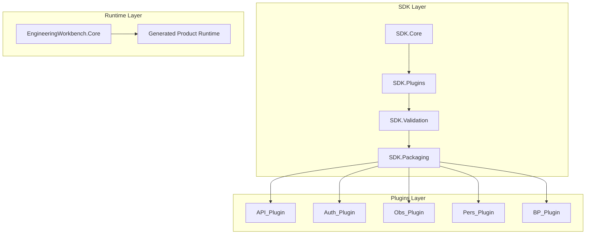

# PLUGIN FACTORY V1.0 CLOSURE DECISION

## 1. Executive Decision
The Plugin Factory v1.0 has reached architectural maturity. The fundamental SDK boundaries (Core, Plugins, Validation, Packaging, Testing) are established. The core platform capability generators (API, Authentication, Observability, Persistence) are industrialized. The runtime infrastructure for BackgroundProcessing is certified against real PostgreSQL databases.

**Decision**: The Plugin Factory will be **FROZEN** for v1.0 after completing the `SaaSFoundry.Plugins.BackgroundProcessing` generator. No further generic plugins will be added to the baseline factory before moving to VibeStock implementation.

## 2. Current Plugin Inventory

| Capability | Exists? | Industrialized? | Runtime Gen Exists? | Generic/Reusable | VibeStock Contamination? | Required for v1.0? |
| --- | --- | --- | --- | --- | --- | --- |
| **Observability** | Yes | Yes | Yes | Yes | None | Yes |
| **Persistence** | Yes | Yes | Yes | Yes | None | Yes |
| **API** | Yes | Yes | Yes | Yes | None | Yes |
| **Authentication** | Yes | Yes | Yes | Yes | None | Yes |
| **BackgroundProcessing** | No (Runtime Only)| No | Yes (Hand-coded)| Yes | None | **Yes** |
| **Authorization** | No | No | No | N/A | N/A | No (Deferred) |
| **Commerce / Shopify** | No | No | No | No | High | No (Product-Specific) |

**SDK Inventory:**
- SDK.Core: Certified
- SDK.Plugins: Certified
- SDK.Validation: Certified
- SDK.Packaging: Certified
- SDK.Testing: Certified

## 3. Current Certification Matrix

| Component | Implementation Status | Runtime Status | Certification Status |
| --- | --- | --- | --- |
| **API Plugin** | Complete | Generated source | Plugin Certified |
| **Auth Plugin** | Complete | Generated source | Plugin Certified |
| **Observability** | Complete | Generated source | Plugin Certified |
| **Persistence** | Complete | SystemCellJobStorage | Plugin & Runtime Certified |
| **BackgroundProcessing**| **Missing Generator**| BackgroundWorkerService | Runtime Certified |

## 4. Generic Capability Analysis
The Factory currently provides the universal primitive capabilities required by any modern SaaS product:
1. Serving requests (`API`)
2. Identifying users (`Authentication`)
3. Storing state (`Persistence`)
4. Tracking health (`Observability`)
5. Asynchronous execution (`BackgroundProcessing`)

## 5. Candidate Plugins
Other potential capabilities were analyzed for factory inclusion:
- **Configuration & Secrets**: Solved by native .NET configuration and Environment variables. No code-gen needed.
- **Caching**: Usually an extension of Persistence (e.g. Redis).
- **File/Object Storage**: Could be generic (S3/Azure), but often product-specific. Deferred.
- **Messaging/Eventing**: Covered partially by BackgroundProcessing for intra-system. Inter-system PubSub can be deferred.

## 6. Rejected Candidates
- **Data Import/Export**: Highly coupled to product domain models (e.g., Shopify models vs. Fixed Asset models).

## 7. Mandatory Plugins (Remaining)
- `SaaSFoundry.Plugins.BackgroundProcessing` (Must wrap the certified `BackgroundWorkerService` into a standardized generator).

## 8. Optional Specialized Plugins
- **Commerce**: A generic commerce/billing engine might eventually be an optional plugin, but not mandatory for the baseline factory.

## 9. Deferred Capabilities
- **File/Object Storage**
- **Notification / Email Gateway**
- **Search (Elastic/OpenSearch)**

## 10. VibeStock-Specific Capabilities
- **Shopify GraphQL Integration**
- **Product Normalization / AI Mapping**
- **Commerce Sync Workflows**

## 11. Cell Runtime Mapping

The Generated Product Runtime cleanly maps to the approved Macro-Cell Topology:

- **Core.Cell**: API, Authentication, Observability, Persistence
- **Ingestor.Cell**: API, Authentication, Observability, Persistence
- **Bridge.Cell**: API, Authentication, Observability, Persistence, Shopify Logic
- **System.Cell**: BackgroundProcessing, Observability, Persistence

*Note: Persistence executes inside each cell pointing to its own data store/schema.*

## 12. Dependency Graph

## 13. Certification Requirements
To achieve Factory Freeze, the `BackgroundProcessing` plugin must achieve **Plugin Certification** (generating the source artifacts currently residing manually in `System.Cell`).

## 14. Engineering Effort Estimates

- **BackgroundProcessing Plugin Generator**: 1–3 engineering days.
  - Architecture/design: 0.5 days
  - Plugin implementation: 1 day
  - Tests & Certification: 1 day

- **TOTAL ESTIMATED EFFORT**: 1.5–2.5 engineering days.

## 15. Final Factory v1.0 Scope
- Core SDKs (Core, Plugins, Validation, Packaging, Testing)
- Observability Plugin
- Persistence Plugin
- API Plugin
- Authentication Plugin
- BackgroundProcessing Plugin

## 16. Factory Freeze Criteria
The factory will be declared FROZEN once `SaaSFoundry.Plugins.BackgroundProcessing` successfully generates the exact runtime infrastructure validated in Stage 9G.4M, with full deterministic generation and passing unit tests.

## 17. Transition Plan to VibeStock
Upon Factory Freeze:
1. VibeStock Cell Projects (`VibeStock.Core.Cell`, etc.) will be cleared of manual prototype code.
2. The EngineeringWorkbench will orchestrate the generation of the VibeStock baseline using the 5 core plugins.
3. VibeStock product-specific logic (Shopify integration, AI mapping) will be implemented directly in the generated Cell runtimes.

---

### Special Determinations
#### Authorization Decision
**Authorization should remain part of the product/runtime composition rather than a separate plugin.**
Authorization relies on `Authentication` and standard runtime policy configurations (e.g. `[Authorize]`). It doesn't require complex infrastructure generation and is deeply tied to the domain models (e.g. Can user edit *this* VibeStock product?). Deferred to product layer.

#### Commerce / Shopify Decision
**Commerce/Shopify must be treated as a VibeStock-specific product capability.**
A Fixed Asset Manager cannot reuse Shopify synchronization. Shopify is not a universal primitive. Bridge.Cell will house this specific logic. Do not build a Shopify plugin for Factory v1.0.
